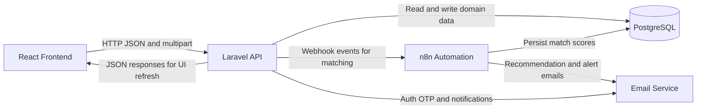
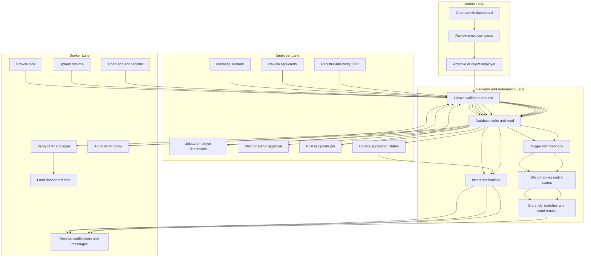
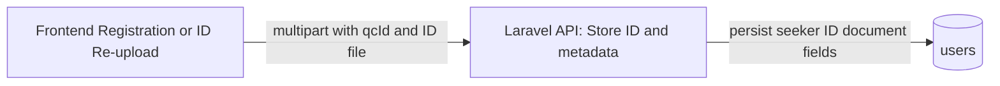

# CityJobLink_2 Workflow Documentation

Updated: March 16, 2026

## 1) Full Workflow In Sentences (Start To Finish)

CityJobLink_2 is a React frontend plus a Laravel API backend connected to PostgreSQL, with n8n automation used for AI-style job matching and recommendation email flows.

When the frontend starts, `frontend/src/App.jsx` checks local storage for a saved user session. If no user exists, the app shows public pages like landing, public trainings, and public job fairs, and then routes users to login when they need protected actions.

When a seeker creates an account, the frontend sends multipart form data to `POST /api/register`, including optional QC ID number and uploaded ID image or PDF. The backend stores the ID file in pending storage, keeps ID verification fields in `not_submitted`, generates a one-time password (OTP), stores pending registration data in cache, and sends the OTP by email. The account is not created in the `users` table yet at this point.

When an employer creates an account, the frontend still calls `POST /api/register` but without seeker ID requirements. The backend keeps the same OTP-first registration behavior and stores employer-specific profile fields.

When the user submits the OTP, the frontend calls `POST /api/verify-otp`. The backend verifies cached OTP data, creates the user in `users`, moves the pending seeker ID file into a user-specific folder when applicable, and completes registration. ID documents are stored for later use, but automated ID validation is currently disabled. The frontend then performs login using `POST /api/login`, stores user data in local storage, and redirects to the correct dashboard based on role.

For password recovery, users first call `POST /api/forgot-password/request` to receive a reset OTP, then `POST /api/forgot-password/reset` to set a new password.

After login, the frontend bootstraps dashboard data based on role:

- Seeker flow loads profile, jobs, trainings, own applications, notifications, recommendation list, and messages.
- Employer flow loads own jobs, applications to those jobs, seeker summaries, notifications, and messages.
- Admin flow loads employer verification queue and open or closed jobs for oversight.

In the seeker job search flow, the seeker views job listings from `GET /api/jobs` and can apply using `POST /api/applications/apply`. The backend enforces one application per seeker per job, checks educational qualification rules, and either auto-rejects unqualified applicants with a reason or creates a pending application. It also inserts notifications for relevant users.

In the seeker application management flow, the seeker views own application states from `GET /api/applications/seeker` and can withdraw an application using `PATCH /api/applications/withdraw` with a required reason.

In the seeker training flow, the seeker views available trainings from `GET /api/trainings`, registers through `POST /api/trainings/register`, and can withdraw using `PATCH /api/trainings/withdraw`. Training capacity is enforced by the backend.

In the seeker profile flow, resume upload happens via `POST /api/upload/resume`. The backend stores the file, extracts text, derives skills and education metadata, updates the seeker profile, clears stale rows in `job_matches`, and triggers the n8n seeker-resume workflow webhook if configured. Resume removal is `DELETE /api/upload/resume`, which deletes file and metadata and clears seeker match rows.

In the seeker ID document flow, a seeker can upload or replace ID documents using `POST /api/upload/seeker-id-document`. The backend stores the file and metadata, resets extracted and verification detail fields, and keeps status as `not_submitted`. No OCR or callback processing is executed.

In the employer account flow, employers upload verification documents through `POST /api/upload/employer-documents`. The backend stores documents and marks account as pending verification. Employer profile updates happen through `POST /api/employer/update-profile`.

In the employer job management flow, verified employers post jobs through `POST /api/jobs`, edit with `PUT /api/jobs/{id}`, and delete with `DELETE /api/jobs/{id}`. Each create or update triggers an n8n job-matching webhook if configured. There is also an alternate endpoint `POST /api/employer/jobs` that inserts a job and triggers n8n.

In the employer applicant review flow, employer reads applications using `GET /api/applications/employer`, where each applicant gets fit score and match details based on skills and education rules plus latest n8n score when available. Employer updates status using `PATCH /api/applications/status`, and seeker receives notification for status change.

In the admin verification flow, admin reads employer records using `GET /api/admin/employers` and approves or rejects employer accounts with `PATCH /api/admin/employers/review`.

In notifications flow, users fetch notifications with `GET /api/notifications` and mark each notification read with `PATCH /api/notifications/read`. There is also `POST /api/pulse/generate` that creates a summary notification based on active applications.

In messaging flow, users fetch conversation data via `GET /api/messages`, send via `POST /api/messages/send`, and mark chat messages read via `PATCH /api/messages/read`. Sending a message also inserts a notification for the receiver.

In match visibility flow, seeker and employer UI can call `GET /api/match-metrics` for job-to-seeker skill and education metrics. If latest n8n score exists and education gate passes, that score is preferred.

n8n currently has two active workflow JSON definitions under `n8n/`:

- `my-workflow-fixed.json` is triggered on job creation or update webhook, reads seekers with resumes, computes scores, writes `job_matches`, and emails seekers with score threshold.
- `seeker-resume-recommendation-workflow.json` is triggered on seeker resume upload webhook, reads open jobs, computes seeker-centric matches, writes `job_matches`, and emails recommendation summaries.
- `seeker-id-verification-workflow.json` may still exist in the repository for historical reference, but it is not wired to active backend routes.

From a data lifecycle perspective, most user actions produce one or more of these outcomes: table insert or update, optional notification insert, optional n8n webhook trigger, and frontend state refresh by re-fetching the relevant API resource.

One practical note is that the current API routes are not wrapped in auth middleware, so identity is passed in request payloads (mostly email). That is functional for development but should be hardened for production with token-based authentication and route guards.

---

## 2) Endpoint-By-Endpoint Workflow Matrix

| Method | Endpoint | Primary Actor | Purpose | Main Controller Behavior | Main Tables Affected |
| --- | --- | --- | --- | --- | --- |
| POST | `/api/register` | Seeker, Employer | Start registration | Validate data, generate OTP, cache pending registration, send OTP email | cache only |
| POST | `/api/login` | All roles | Authenticate user | Validate credentials and return user payload | `users` read |
| POST | `/api/verify-otp` | Seeker, Employer | Complete registration | Validate OTP from cache, create user, optionally trigger n8n seeker-registered webhook | `users` insert |
| POST | `/api/forgot-password/request` | All roles | Request password reset OTP | Validate email, cache reset OTP, send reset email | cache only |
| POST | `/api/forgot-password/reset` | All roles | Reset password | Validate OTP and confirmation, hash and save new password | `users` update |
| POST | `/api/upload/resume` | Seeker | Upload and parse resume | Store file, parse text, infer skills and education, update profile, clear stale matches, trigger n8n resume webhook | `users` update, `job_matches` delete |
| DELETE | `/api/upload/resume` | Seeker | Remove resume | Delete stored file and reset parsed resume fields, clear seeker matches | `users` update, `job_matches` delete |
| POST | `/api/upload/employer-documents` | Employer | Submit verification docs | Store docs and set account as pending review | `users` update |
| POST | `/api/upload/seeker-id-document` | Seeker | Submit QC or valid ID for storage | Store seeker ID file and metadata only, keep verification state as not submitted | `users` update |
| GET | `/api/jobs` | All roles | List jobs | Return open jobs by default, supports filters and optional include closed | `jobs_catalog` read |
| POST | `/api/jobs` | Employer | Create job | Validate employer and verification status, insert job, trigger n8n match webhook | `jobs_catalog` insert |
| PUT | `/api/jobs/{id}` | Employer | Update job | Ownership check, update job fields, retrigger n8n match webhook | `jobs_catalog` update |
| DELETE | `/api/jobs/{id}` | Employer | Delete job | Ownership check and delete job row | `jobs_catalog` delete |
| GET | `/api/seeker/profile` | Seeker | Read profile details | Lookup by email and return profile with formatted birthday display | `users` read |
| GET | `/api/seeker/recommendations` | Seeker | Read recommended jobs | Read latest `job_matches`, filter open jobs and minimum score, enforce education match | `job_matches` read, `jobs_catalog` read |
| POST | `/api/applications/apply` | Seeker | Submit application | Prevent duplicates, enforce education gate, insert pending or rejected application, create notification | `applications` insert, `notifications` insert |
| PATCH | `/api/applications/withdraw` | Seeker | Withdraw application | Validate ownership and reason, update status to withdrawn | `applications` update |
| GET | `/api/applications/seeker` | Seeker | View own applications | Return active and withdrawn lists with ribbon mapping | `applications` read, `jobs_catalog` read |
| GET | `/api/applications/employer` | Employer | View applicants for employer jobs | Join jobs, seekers, latest matches, compute fit and education flags | `applications` read, `users` read, `jobs_catalog` read, `job_matches` read |
| PATCH | `/api/applications/status` | Employer | Update applicant status | Validate ownership, update status and rejection reason, notify seeker | `applications` update, `notifications` insert |
| GET | `/api/trainings` | Seeker | List trainings | Return trainings with current slots and registered user IDs | `trainings` read, `training_registrations` read |
| POST | `/api/trainings/register` | Seeker | Register in training | Check duplicate and slot availability, then register | `training_registrations` insert |
| PATCH | `/api/trainings/withdraw` | Seeker | Withdraw from training | Delete registration row for seeker and training | `training_registrations` delete |
| GET | `/api/admin/employers` | Admin | List employers for review | Return employer verification queue fields | `users` read |
| PATCH | `/api/admin/employers/review` | Admin | Approve or reject employer | Set `is_verified` and handle document flags on rejection | `users` update |
| POST | `/api/employer/jobs` | Employer | Alternate job creation endpoint | Validate and create job through `JobCatalog` model, trigger n8n webhook | `jobs_catalog` insert |
| GET | `/api/notifications` | All roles | Fetch notifications | Return notifications for current user by email | `notifications` read |
| PATCH | `/api/notifications/read` | All roles | Mark notification read | Set read timestamp on notification | `notifications` update |
| POST | `/api/pulse/generate` | Seeker | Generate status pulse | Compute active application count and create pulse notification | `applications` read, `notifications` insert |
| GET | `/api/messages` | All roles | Load conversations | Return messages with sender and receiver labels | `messages` read, `users` read |
| POST | `/api/messages/send` | All roles | Send message | Insert message and create receiver notification with preview | `messages` insert, `notifications` insert |
| PATCH | `/api/messages/read` | All roles | Mark chat as read | Mark unread messages from a contact as read | `messages` update |
| GET | `/api/match-metrics` | Seeker, Employer | Get job-seeker fit metrics | Compute skill and education metrics, prefer latest n8n score when valid | `jobs_catalog` read, `users` read, `job_matches` read |
| POST | `/api/employer/update-profile` | Employer | Update employer profile | Save employer organization fields | `users` update |

---

## 3) System Flowchart (Architecture And Data Flow)

---

## 4) Role-Based BPMN-Style Flow (Seeker, Employer, Admin Lanes)

---

## 5) End-To-End Narrative Example (One Complete Business Cycle)

A seeker registers, receives OTP, verifies the account, and logs in. The seeker uploads a resume, which the backend parses into skills and education metadata, then sends a webhook to n8n. n8n evaluates the seeker against open jobs, writes rows to `job_matches`, and sends recommendation email. The seeker now sees recommendation cards in the dashboard.

An employer registers, uploads verification documents, and waits for admin approval. After approval, the employer posts a new job. The backend stores the job and immediately triggers the job matching n8n workflow. n8n scans seeker resumes, computes fit scores and reasons, writes `job_matches`, and can email matched seekers.

A seeker applies to that job. The backend checks if the seeker is educationally qualified. If qualified, a pending application is inserted and the employer gets notification. If not qualified, an auto-rejected application is saved with reason and the seeker is informed.

The employer opens applicant list, sees fit scores and reasons, messages candidates, and moves applicants through statuses like Viewing, Interview, Hired, or Rejected. Each status change inserts a notification for the seeker, and the seeker sees updates in dashboard timeline and notifications panel.

This cycle repeats as jobs and resumes change. Matching, notifications, and messaging keep the system synchronized between seekers and employers while admin maintains employer trust through verification review.

For seeker ID handling, document uploads are retained for storage and future workflows. Automated OCR verification and callback processing are intentionally disabled in the current backend flow.

---

## 6) Technical Notes And Current Constraints

- API identity currently relies on request payload values like `email` instead of authenticated middleware routes.
- Job fairs are currently frontend-local in state and local storage, while trainings are backend-persisted.
- n8n workflows in the repo are present as JSON and appear configured for local n8n endpoints.
- Key n8n backend environment keys now include `N8N_MATCH_WEBHOOK_URL` and `N8N_SEEKER_RESUME_WEBHOOK_URL`.

---

## 7) ID Document Storage Flowchart

